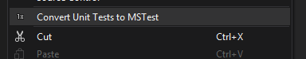
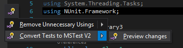
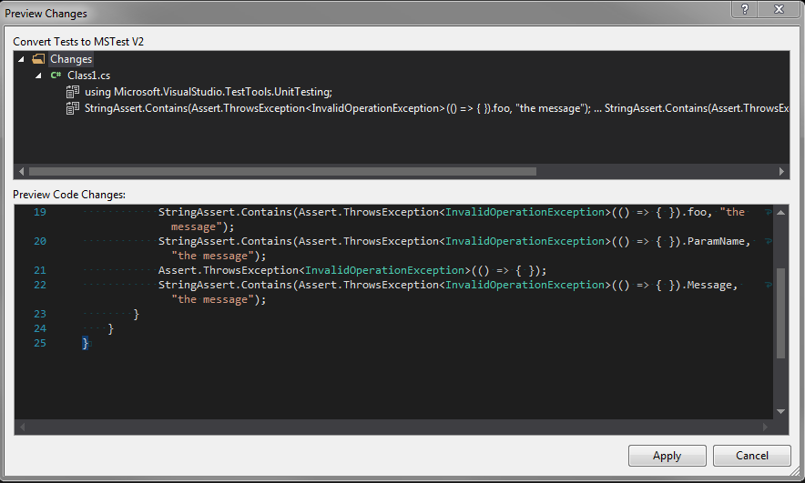
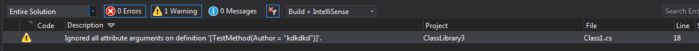

# NUnitToMSTest

A Visual Studio extension to convert a project, using the NUnit test framework, to use MSTest V2.

## Status

|   | Build & Test |
|---|:-----:|
| **Windows**||

## Features

Feature Overview:

* Convert common attributes
* Convert common Assert invocations
* Make sure project contains properties like a stock UnitTest project
* Add MSTest NuGet packages to project
* Remove NUnit packages from project

For details on features see unit tests.
For more things in anger see [TODO.txt](TODO.txt).
For more information on migration see [NOTES.md](NOTES.md).

You can convert either complete projects

by using the "Convert Unit Tests to MSTest" from a project's context menu.

Or you can convert single files, by invoking the "Convert Tests to MSTest"
context action, which will be shown, next to `using NUnit.Framework` statements.

Additionally, this option allows you see a preview of changes:

Finally, look in the "Error List" for warnings that might have been emitted
during the conversion process.

## Build

To build and test everything, simply use:

     build-full.cmd

You will find a VSIX as `NUnitToMSTestPackage\bin\Release\NUnitToMSTestPackage.vsix`.

(Release build instructions are [here](docs/Releases.md).)
